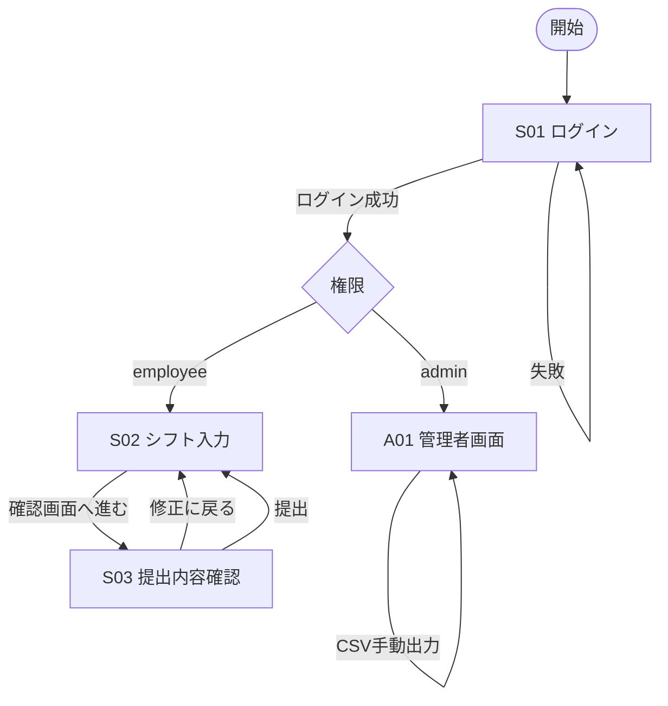

# 1. 画面遷移図

## 画面一覧
- `S01` ログイン画面（社員プルダウン + メール入力）
- `S02` 社員シフト入力画面
- `S03` 提出内容確認画面
- `A01` 管理者画面

## 画面遷移（Mermaid）

## 遷移ルール
- 社員は同一対象月に1回のみ提出可能
- 確認画面はページ遷移方式で実装
- 提出後にCSV差分出力が自動実行される
- 管理者は手動でCSV出力を再実行できる
