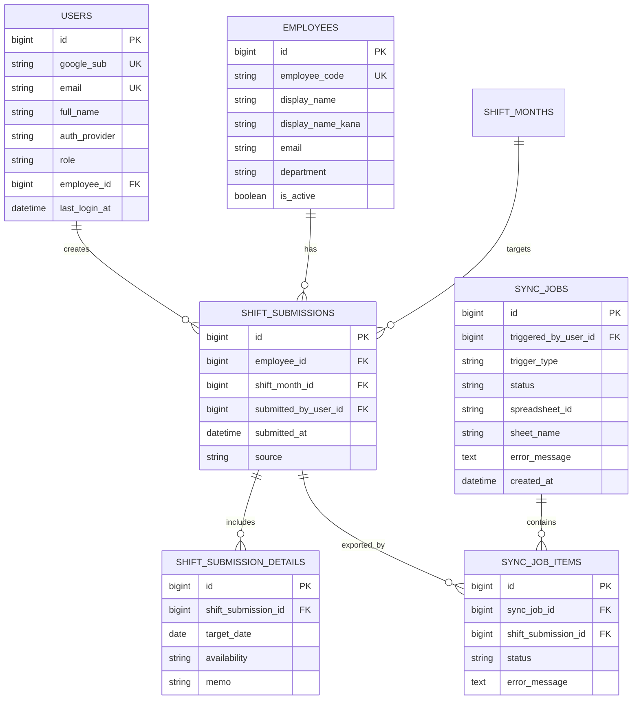

# 2. ER図（要点）

## ER図（Mermaid）

## 現行設計ポイント
- `employees` はログイン画面のプルダウン元
- ログイン時入力メールは `employees.email` と `users.email` に反映
- 同期は外部サービス連携ではなく、DB内容のCSV出力ジョブとして管理
- 出力差分は `storage/csv/**/index.json` のハッシュ比較で判定
